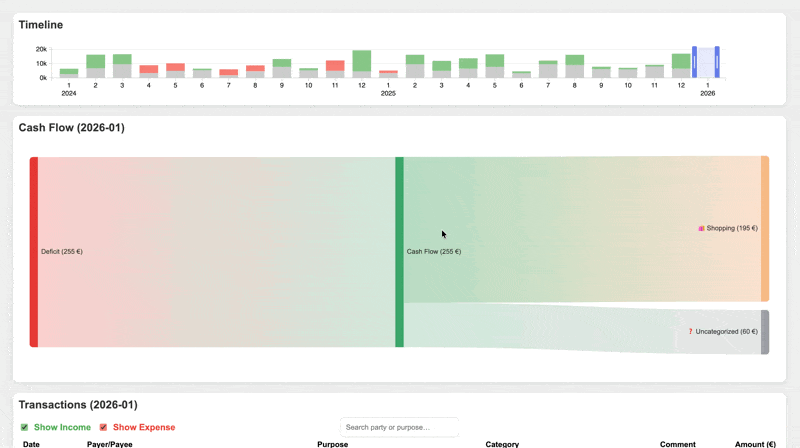

# Personal Finance



## Overview

This is a small Personal Finance web app that serves a simple UI to explore and annotate transaction data stored as CSV files. It includes example data under `example_data/` and a lightweight FastAPI app (`app.py`) which renders the dashboard and exposes any APIs needed by the frontend.

## Usage

Development (auto-reload):

```sh
uv run uvicorn app:app --reload
```

Run with a specific data directory (example):

```sh
PERSONAL_FINANCE_DATA_DIR=example_data uv run uvicorn app:app
```

Notes:

- `transactions.csv` must contain the expected columns for the app to parse and visualize data. The repository includes `example_data/transactions.csv` as a reference.
- `transaction_annotations.csv` can be used to store user-provided notes or categories for transactions; the app will read it if present.
- If you plan to run this in production, replace `uv run uvicorn ...` with your preferred ASGI runner invocation and set proper environment variables and secrets.

## CSV column specification

The example `example_data/transactions.csv` is a semicolon-separated CSV with the following columns (header row present):

- `date` (string) — transaction date in DD.MM.YYYY format. Example: `19.10.2025`.
- `amount` (decimal/string) — amount in localized format using comma as decimal separator and dot as thousand separator (e.g. `3.720,67` for 3720.67). Positive amounts are inflows; negative amounts are outflows. Example: `-436,75`.
- `payer` (string, optional) — who paid (for inflows). Example: `SideProject Inc` or blank.
- `payee` (string, optional) — recipient of the payment (for outflows). Example: `Pharmacy` or blank.
- `purpose` (string) — transaction memo or category. Example: `Salary`, `Shopping`, `Membership`.

Parsing notes

- The repo's example CSV uses `;` as the field delimiter and a comma as the decimal separator. When loading in Python, use the `csv` module or `pandas.read_csv(..., sep=';', decimal=',')` to parse correctly.
- Date parsing: use format `%d.%m.%Y` when converting to datetime objects.
